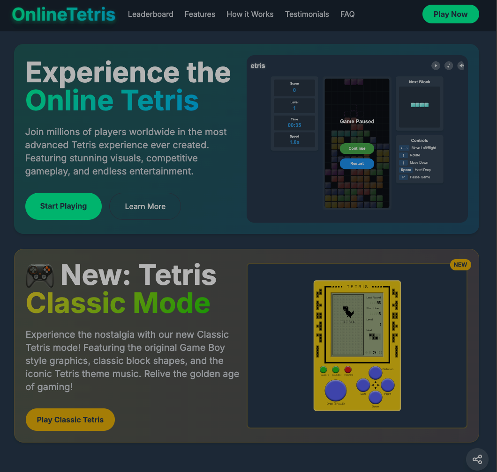
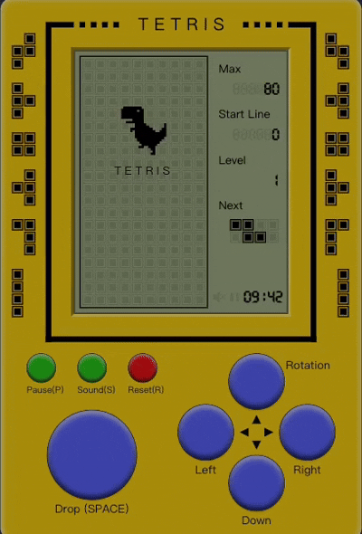
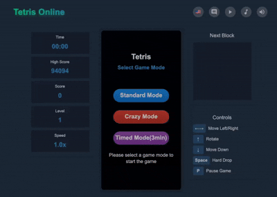

### 🌐 [Play Now - Official Website](https://onlinetetris.org/)

---

### [Classic Retro Mode](https://onlinetetris.org/GoodOldTetris)

---

### [Modern Enhanced Mode](https://onlinetetris.org/tetris-pc)

---

🧩 **Free to Play Online**
Enjoy classic Tetris completely free — no downloads, no sign-ups, just click and play.

🚀 **No Registration Required**
No accounts or logins needed. Jump straight into the game hassle-free.

🌐 **Pure Browser Experience**
Play directly in your browser without taking up storage space. Fast and smooth gameplay guaranteed.

---

### Supported Game Modes

🎮 **Classic Retro Mode**
A faithful recreation of the original Tetris — simple, clean, and nostalgic.

🆕 **Modern Enhanced Mode**
Updated with modern elements and optimized for a better, smoother playing experience across devices.

🏃 **Fast Mode**
High-speed gameplay designed for players who love a challenge.

⏱️ **Timed Mode**
Score as high as you can within a set time limit — perfect for testing your strategy and reflexes.

---

### Leaderboard Features

🏆 **Global Leaderboard**
Compete with players worldwide and climb the global rankings.

📅 **Weekly Leaderboard**
Track your weekly progress with a refreshed leaderboard every week — new challenges await.

---

### Key Features

- Free to play with no ads
- Supports classic and modern gameplay modes
- No downloads, no registration — instant play
- Global and weekly leaderboards with real-time updates
- Smooth keyboard controls; optimized for desktops and laptops
